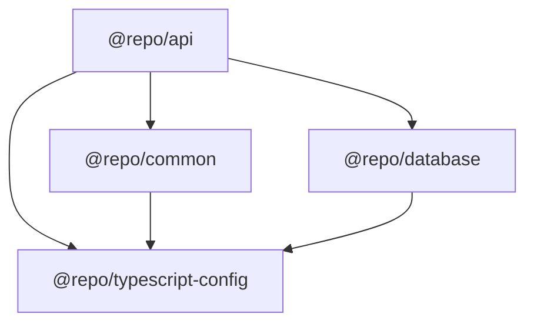

# Architecture

## Overview

This is a monorepo template built with Turborepo for NestJS applications with Prisma ORM.

## Monorepo Structure

```
├── apps/
│   └── api/                    # NestJS API application (@repo/api)
├── packages/
│   ├── common/                 # Shared code (@repo/common)
│   ├── database/               # Prisma schema (@repo/database)
│   ├── eslint-config/          # ESLint config (@repo/eslint-config)
│   ├── prettier-config/        # Prettier config (@repo/prettier-config)
│   └── typescript-config/      # TypeScript config (@repo/typescript-config)
```

## Package Dependencies



## @repo/api

The main NestJS API application.

### Directory Structure

```
apps/api/src/
├── decorator/              # Custom decorators
│   ├── decorator.cookies.ts
│   ├── decorator.jwt-payload.ts
│   └── decorator.public-route.ts
├── filter/                 # Exception filters
│   └── filter.http-exception.ts
├── guard/                  # Auth & rate limiting guards
│   ├── guard.authorization.ts
│   └── guard.throttler.ts
├── interceptor/            # Response interceptors
│   └── interceptor.response.ts
├── middleware/             # Request middleware
│   └── middleware.logger.ts
├── module/                 # Feature modules
│   ├── auth/               # Authentication module
│   ├── user/               # Example CRUD module
│   ├── jwt/                # JWT service
│   └── smtp/               # Email service
├── pipe/                   # Validation pipes
├── types/                  # TypeScript types
├── app.module.ts           # Root module
└── main.ts                 # Application entry point
```

### Key Features

- **Fastify Adapter**: High-performance HTTP server
- **JWT Authentication**: Cookie-based JWT tokens
- **Rate Limiting**: Configurable throttling via @nestjs/throttler
- **Global Exception Filter**: Standardized error responses
- **Request Logging**: Middleware for request/response logging
- **Swagger/OpenAPI**: API documentation via @scalar/nestjs-api-reference

## @repo/common

Shared code library.

### Directory Structure

```
packages/common/src/
├── dto/                    # Data Transfer Objects
│   ├── dto.user.ts         # User DTOs
│   ├── dto.auth.ts         # Auth DTOs
│   └── index.ts            # Re-exports
├── module/
│   └── prisma/             # PrismaModule & PrismaService
└── index.ts                # Package exports
```

### Exports

- DTOs with class-validator decorators
- PrismaModule and PrismaService

## @repo/database

Prisma ORM configuration and schema.

### Directory Structure

```
packages/database/
├── prisma/
│   ├── schema.prisma       # Main schema file
│   └── models/
│       └── user.prisma     # User model
└── src/
    └── index.ts            # Package exports
```

### Example Model

```prisma
model User {
  id        String   @id @default(uuid()) @db.Uuid
  email     String   @unique
  name      String?
  isActive  Boolean  @default(true)
  createdAt DateTime @default(now())
  updatedAt DateTime @updatedAt

  @@map("users")
}
```

## Build System

### Turborepo Tasks

- **build**: Build packages with dependencies
- **lint**: Run ESLint
- **dev**: Development mode (no caching)
- **db:generate**: Generate Prisma client
- **db:migrate**: Run Prisma migrations (dev)
- **db:deploy**: Deploy Prisma migrations (production)

## Adding New Features

### New Module in API

1. Create module directory in `apps/api/src/module/`
2. Create controller, service, and module files
3. Register module in `app.module.ts`

### New Shared DTO

1. Create DTO in `packages/common/src/dto/`
2. Export from `packages/common/src/dto/index.ts`
3. Rebuild common: `pnpm build:common`

### New Database Model

1. Create model file in `packages/database/prisma/models/`
2. Generate Prisma client: `pnpm --filter @repo/database db:generate`
3. Create migration: `pnpm --filter @repo/database db:migrate`
