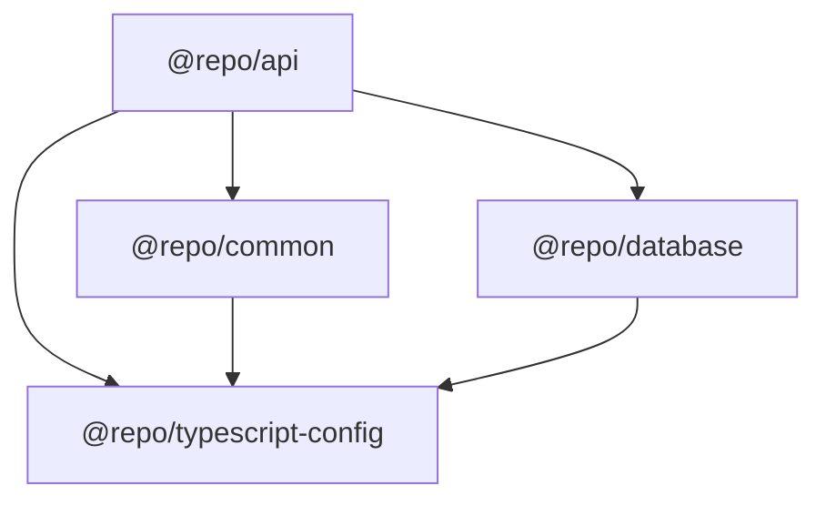

# Architecture

## Overview

This is a monorepo template built with Turborepo for NestJS applications with Prisma ORM.

## Monorepo Structure

```
├── apps/
│   └── api/                    # NestJS API application (@repo/api)
├── packages/
│   ├── common/                 # Shared code (@repo/common)
│   ├── database/               # Prisma schema (@repo/database)
│   ├── eslint-config/          # ESLint config (@repo/eslint-config)
│   ├── prettier-config/        # Prettier config (@repo/prettier-config)
│   └── typescript-config/      # TypeScript config (@repo/typescript-config)
├── env/                        # Centralized environment files
│   ├── .env.example            # Template for all env vars
│   ├── .env.dev                # Development environment
│   ├── .env.e2e                # E2E testing environment
│   └── .env.prod               # Production (gitignored)
```

## Package Dependencies



## Environment Management

Environment files are centralized in the `env/` directory. Scripts use `dotenv-cli` to load the appropriate env file before execution:

```
env/.env.dev   -> Development (pnpm dev:api, docker:dev:*)
env/.env.e2e   -> E2E Testing (pnpm e2e:api, docker:e2e:*)
env/.env.prod  -> Production  (pnpm start:prod)
```

Each environment uses different ports to avoid conflicts when running simultaneously.

### How env loading works

- **API scripts**: `dotenv -e ../../env/.env.dev -- nest start --watch`
- **Prisma scripts**: `dotenv -e ../../env/.env.dev -- prisma migrate deploy`
- **Docker scripts**: `docker compose --env-file env/.env.dev -f docker-compose.dev.yml up -d`
- **E2E tests**: `vitest.e2e-setup.ts` loads `env/.env.e2e` via dotenv

## @repo/api

The main NestJS API application.

### Directory Structure

```
apps/api/
├── src/
│   ├── decorator/              # Custom decorators
│   │   ├── decorator.jwt-payload.ts
│   │   └── decorator.public-route.ts
│   ├── filter/                 # Exception filters
│   │   └── filter.http-exception.ts
│   ├── guard/                  # Auth & rate limiting guards
│   │   ├── guard.authorization.ts
│   │   └── guard.throttler.ts
│   ├── interceptor/            # Response interceptors
│   │   └── interceptor.response.ts
│   ├── middleware/             # Request middleware
│   │   └── middleware.logger.ts
│   ├── module/                 # Feature modules
│   │   ├── auth/               # Authentication module
│   │   ├── user/               # Example CRUD module
│   │   ├── jwt/                # JWT service
│   │   └── smtp/               # Email service
│   ├── types/                  # TypeScript types
│   ├── app.module.ts           # Root module
│   └── main.ts                 # Application entry point
└── test/                       # E2E tests
    ├── e2e/                    # E2E test files (e2e.*.ts)
    ├── utils/                  # Test utilities
    │   └── utils.app-builder.ts
    ├── vitest.e2e-config.ts    # Vitest configuration
    └── vitest.e2e-setup.ts     # Env loading for tests
```

### Key Features

- **Fastify Adapter**: High-performance HTTP server
- **JWT Authentication**: Cookie-based JWT tokens
- **Rate Limiting**: Configurable throttling via @nestjs/throttler
- **Global Exception Filter**: Standardized error responses
- **Request Logging**: Middleware for request/response logging
- **Swagger/OpenAPI**: API documentation via @scalar/nestjs-api-reference

## E2E Testing

### Stack

- **Vitest**: Test runner with SWC for fast TypeScript compilation
- **unplugin-swc**: SWC integration for decorator metadata support
- **@nestjs/testing**: NestJS testing utilities

### Configuration

- `vitest.e2e-config.ts`: Vitest config with SWC plugin, path aliases (`#` -> `src/`), 30s timeouts, sequential execution
- `vitest.e2e-setup.ts`: Loads `env/.env.e2e` before tests run
- `utils.app-builder.ts`: Bootstraps the full NestJS application with Fastify, global pipes/guards/interceptors, and database cleanup

### Running Tests

```bash
# Start E2E infrastructure
pnpm docker:e2e:up

# Initialize E2E database
pnpm init:db:e2e

# Run tests
pnpm e2e:api
```

### Writing New Tests

1. Create test file in `apps/api/test/e2e/` with pattern `e2e.<name>.ts`
2. Use `buildE2eApp()` to bootstrap the app
3. Use Fastify `inject()` for HTTP assertions

## @repo/common

Shared code library.

### Directory Structure

```
packages/common/src/
├── dto/                    # Data Transfer Objects
│   ├── dto.user.ts         # User DTOs
│   ├── dto.auth.ts         # Auth DTOs
│   └── index.ts            # Re-exports
├── module/
│   └── prisma/             # PrismaModule & PrismaService
└── index.ts                # Package exports
```

### Exports

- DTOs with class-validator decorators
- PrismaModule and PrismaService

## @repo/database

Prisma ORM configuration and schema.

### Directory Structure

```
packages/database/
├── prisma/
│   ├── schema.prisma       # Main schema file
│   └── models/
│       └── user.prisma     # User model
├── prisma.config.ts        # Prisma config (datasource URL from env)
└── src/
    └── index.ts            # Package exports
```

### Example Model

```prisma
model User {
  id        String   @id @default(uuid()) @db.Uuid
  email     String   @unique
  name      String?
  isActive  Boolean  @default(true)
  createdAt DateTime @default(now())
  updatedAt DateTime @updatedAt

  @@map("users")
}
```

## Build System

### Turborepo Tasks

| Task            | Description                              | Cached |
| --------------- | ---------------------------------------- | ------ |
| `build`         | Build packages with dependencies         | Yes    |
| `lint`          | Run ESLint                               | Yes    |
| `dev`           | Development mode                         | No     |
| `db:generate`   | Generate Prisma client                   | No     |
| `db:migrate`    | Run Prisma migrations (dev)              | No     |
| `db:deploy`     | Deploy Prisma migrations                 | No     |
| `db:deploy:e2e` | Deploy Prisma migrations (E2E)           | No     |
| `db:migrate:e2e`| Run Prisma migrations (E2E)              | No     |
| `test:e2e`      | Run E2E tests (depends on build)         | No     |

## Adding New Features

### New Module in API

1. Create module directory in `apps/api/src/module/`
2. Create controller, service, and module files
3. Register module in `app.module.ts`

### New Shared DTO

1. Create DTO in `packages/common/src/dto/`
2. Export from `packages/common/src/dto/index.ts`
3. Rebuild common: `pnpm build:common`

### New Database Model

1. Create model file in `packages/database/prisma/models/`
2. Generate Prisma client: `pnpm --filter @repo/database db:generate`
3. Create migration: `pnpm --filter @repo/database db:migrate`

### New E2E Test

1. Create test file in `apps/api/test/e2e/` with pattern `e2e.<name>.ts`
2. Import `buildE2eApp` from `../utils/utils.app-builder`
3. Add table cleanup to `utils.app-builder.ts` if new models are used
4. Run: `pnpm e2e:api`
